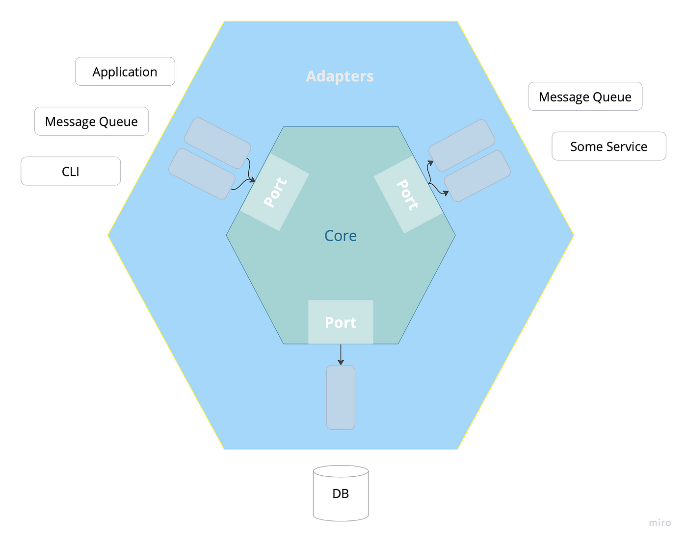
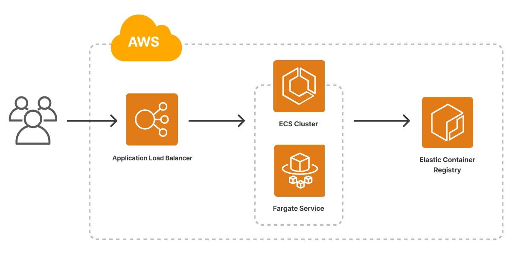

# Vector Case Study


Following PL were considered for the implementation:
- Java
- Kotlin
- Go

### Java
Pros:
- Cross-platform (Runs on JVM)
- Has a variety of frameworks for web and microservice dev (Spring, SpringBoot, SpringCloud, Jakarta RS, etc)

Cons:
- Verbose
- Requires a lot of "boiler-plate" code
- Requires runtime JVM (JRE), runtime dependencies thus:
  - bigger container image size, 
  - slower startup time, 
  - relatively slow*
  - memory overhead

### Kotlin
Pros:
- Compiles into JVM byte-code
- "Better", less verbose syntax comparing to Java
- Use whatever you'd use in Java and more (like KTor)

Cons:
- JVM version same as Java with respect to memory and performance

### Go
Pros:
- Simplicity
- Great standard lib
- Built in server capabilities
- Fast and efficient
- Perfect cross-compiling model
- Easy to containerize, small image size

Cons:
- Runs natively* (no cross-platform, but due to great cross-compiling capability is still a great choice)

#### Result
> Go was chosen for the implementation

## Service architecture
Hexagonal architecture was chosen


## Primary concerns

## Secondary concerns
- Logging

## Build and test
- Test code with coverage
```sh
go test -cover ./...
```
- Build
```sh
go build cmd/main.go
```
- Run locally:
```sh
  go run cmd/main.go
```


## Generate OpenAPI Spec
```sh
 SWAGGER_GENERATE_EXTENSION=false swagger generate spec -o ./apidocs/swagger.json
```

## Architecture overview



### AWS Deployment
- Create an ECR repository
- Build and push a docker image to Docker Hub
- Create an ECS Fargate cluster (serverless)
- Create an ECS Task definition
- Create an ECS service 
- Create a GitHub Actions Pipeline

## Deployment
### Deployment pipelines
- Test
[test pipeline definition](./.github/workflows/test-pipeline.yml)

Status: 
- Docker image build & push
  [docker push](./.github/workflows/docker-build-pipeline.yml)

Status: 

- AWS ECS deployment
  [ECS deploy definition](./.github/workflows/ecs-deploy-pipeline.yml)

Status: 

